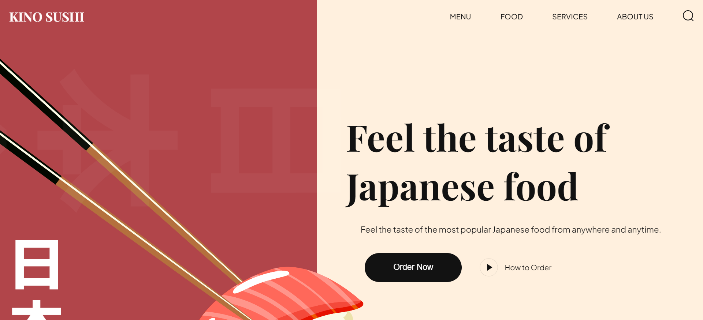
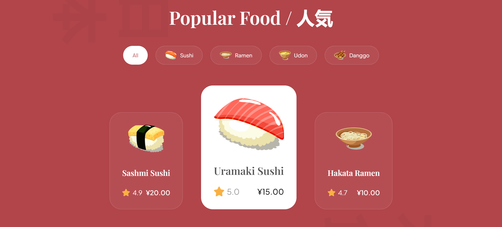
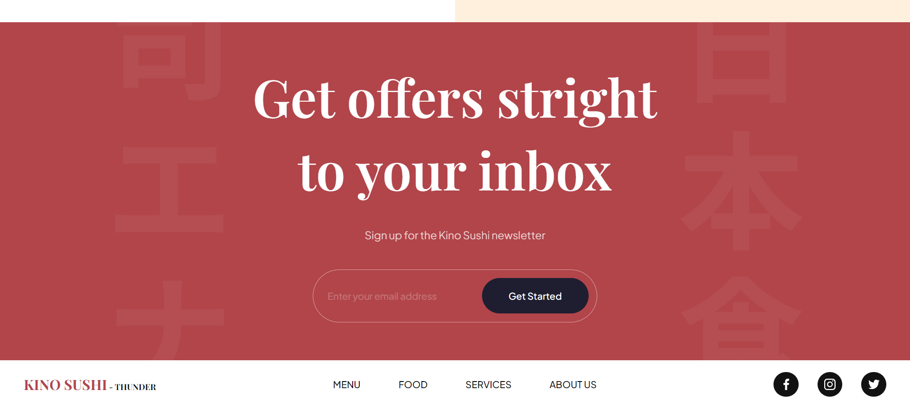

# Kino Sushi - Responsive Landing Page

## Description
This project is a responsive landing page designed for Kino Sushi, a fictional sushi delivery service. The landing page is built using HTML and CSS to provide a sleek and visually appealing interface for users to learn about Kino Sushi's offerings and place orders conveniently.\

Have a peek: https://kino-sushi.vercel.app/

## Features:
 - Responsive Design: The landing page is designed to adapt to various screen sizes, ensuring an optimal viewing experience across devices such as desktops, tablets, and smartphones.
 - Clean and Intuitive Layout: The layout is organized and easy to navigate, with clear sections for menu items, order placement, and contact information.
 - Attractive Visuals: Eye-catching images of sushi dishes are used to entice users and showcase the variety of offerings available.
##

